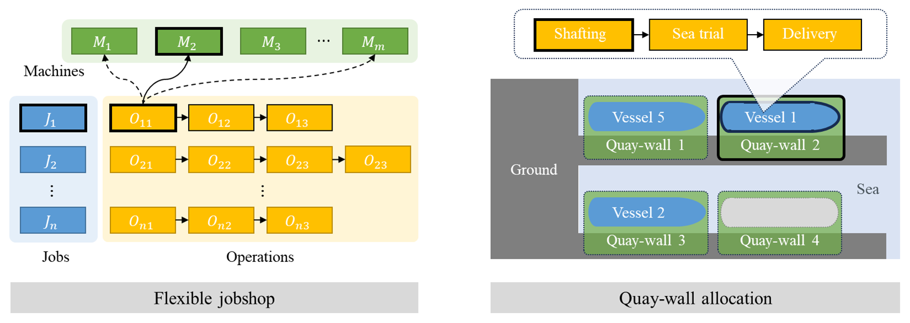
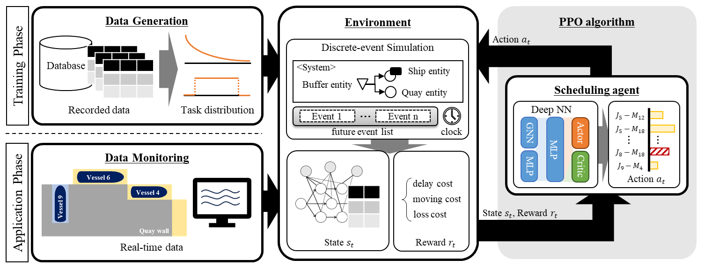

# 2021_QWAP_SHI

|                 Developer                |               Developer               |                
| :--------------------------------------: | :-----------------------------------: | 
| [Young-in Cho](https://github.com/Youngin-Cho) | [Seung-heon Oh](https://github.com/hyunjinei) |
|         🧑‍💻 AI-Development               |       🧑‍💻 AI-Development               |                

 

## Project Overview

- Participants
    - Samsung Heavy Industry (SHI)
- History
    - 1st development: 2021.05 ~ 2021.08
    - 2nd development: 2023.06 ~ 2023.12
    - 3rd development: 2024.05 ~ 2024.06

## Project Introduction
We develop a quay wall allocation algorithm for post-stage outfitting processes in shipyards based on deep reinforcement learning
 
The quay wall allocation problem (QWAP) is modeled as a flexible job shop scheduling problem (FJSP) with preemption and machine preference. The QWAP is formulated as a sequential decision-making problem based on Markov decision process. The scheduling agent is trained 

 

## Main Function

### 1️⃣ Overall framework

 

### 2️⃣ Markov decision process

#### 2.1 State
- a compound state representation composed of a heterogeneous graph and auxiliary matrix
    - **heterogeneous graph**: a modified disjunctive graph for FJSP
        - nodes representing quay walls and operations
        - edges representing low preference / high preference / precedence constraints
    - **auxiliary matrix**: a matrix for predicting the effects of the scheduling actions

#### 2.2 Action
- a combination of the vessel and quay-wall (machine assignment and job sequencing)
    - **candidate vessels**
        - newly launched vessels from the docks
        - vessels returning from sea trials
        - vessels waiting at sea owing to the shortage of quay-walls
        - vessels that need to be reallocated due to interruption
    - **candidate quay walls**
        - empty quay walls
        - occupied quay walls with preemption allowed

#### 2.3 Reward
- minimization of the total cost in the post-stage outfitting process
- a sum of three cost-related rewards
    - **penalty cost**: the penalty cost for the delay in the delivery of vessels
    - **moving cost**: the cost of moving the vessels
    - **loss cost**: the additional processing cost

 

### 3️⃣ DES-based learning environment
- DES model of the post-stage outfitting process in shipyards
- state transition that takes the action of the agent as the input and calculates the next state and reward.

 

### 4️⃣ Scheduling agent with PPO algorithm
#### 4.1 Network Structure
- **Representation module**
    - Two types of latent representation are extracted from the heterogeneous graphs and auxiliary matrix, respectively
    - For heterogeneous graphs, the embedding vectors of nodes are generated using the relational information between nodes
    - For an auxiliary matrix, the embedding vectors for combinations of quay-walls and vessels are generated using the MLP layers 
- **Aggregation module**
    - Input vectors for the output model are generated based on the embedding vectors from the representation module
- **Output module**
    - The actor layers calculate the probability distribution over actions $\pi_{\theta} (\cdot|s_t)$
    - The critic layers calculate a approximate state-value function $V_{\pi_{\theta}} (s_t)$, respectively

#### 4.2 Reinforcement Learning Algorithm
- 모든 generation 완료 후 PSO 진행
    - 입자라고 불리는 후보 Solution 집단을 갖고, 검색 공간에서 입자를 이동시켜 최적화

 

## 🗂 Experiments

### 벤치마킹 문제에 대한 성능 테스트
- la 데이터셋 & Ta 데이터셋 & abz5 데이터셋
    - JSSP에 대한 대표적인 벤치마킹 데이터셋
    - 비교 알고리즘
        - **DDQN**
            - 두 개의 Q-네트워크 사용
        - **ACRL35**
            - Actor-critic deep reinforcement
        - **ML-CNN**
            - Multilevel CNN and Iterative Local Search
        - **ILS**
            - Only Iterative Local Search

### 성능 비교 결과

| Problem     | Optimal | DDQN | ML-CNN | ILS  | Non-Local | Proposed |
|-------------|---------|------|--------|------|-----------|----------|
| La01 (10x5) | 666     | 666  | 666    | 666  | 666       | 666      |
| La02 (10x5) | 655     | 655  | 655    | 667  | 688       | 655      |
| La03 (10x5) | 597     | 597  | 603    | 617  | 620       | 597      |
| La04 (10x5) | 590     | 609  | 590    | 590  | -         | 590      |
| La05 (10x5) | 593     | 593  | 593    | 593  | -         | 593      |
| La06 (15x5) | 926     | 926  | 926    | 926  | -         | 926      |
| La07 (15x5) | 890     | 890  | 890    | 890  | -         | 890      |
| Score       | -       | 6    | 6      | 5    | -         | 7        |
| TA21 (20x20)| 1642    | -    | -      | -    | 1952      | 진행중    |
| TA22 (20x20)| 1561    | -    | -      | -    | 1958      | 진행예정 |
| TA31 (30x15)| 1764    | -    | -      | -    | 2112      | 진행예정 |
| Abz5 (10x10)| 1234    | -    | -      | -    | 1338      | 1276     |

 

## 📂 파일 설명

### GAS 폴더
1. **run.py**: 실행 파일
2. **GA.py**: GAEngine 클래스에 관한 파일
3. **Individual.py**: Individual 클래스에 관한 파일
4. **Population.py**: Population 클래스에 관한 파일

### environment 폴더, Config 폴더, postprocessing 폴더
1. **environment 폴더 내 파일**: simpy 환경 설정
2. **Config 폴더 파일 내 RunConfig.py**: Run_Config 클래스 파일
3. **postprocessing 폴더 내 파일**: generate_machine_log 함수 파일

### visualization 폴더
1. **GUI.py**: GUI 파일
2. **Gantt.py**: Gantt 파일

### result 폴더
- **result_Gantt 폴더**: 종료 후 Gantt 차트 png 파일 생성
- **result_txt 폴더**: run.py 실행 후 machine 및 전체 csv 생성

### Data 폴더
- 해당 폴더 내의 파일로 사용 가능

 

## 🏃 실행 방법
1. GAS 폴더로 이동
2. Run.py 내부 하이퍼 파라미터 조정
    - **TARGET_MAKESPAN**: 목표 Makespan
    - **MIGRATION_FREQUENCY**: 이주 간격
    - **random_seed**: 랜덤 시드
    - main 함수 내 **file = 'filename.txt'** 수정
    - **Run_Config(n_job=50, n_machine=20, n_op=1000, population_size=1000, generations=100)** 수정: 데이터의 job, machine, operation 갯수 수정 및 원하는 population size 및 generation 조정
    - **custom_settings** 내 원하는 GA 갯수로 만들기 및 내부 Crossover, Mutation, Selection, local_search, PSO, selective_mutation 및 확률 조정
    - **local_search_frequency**: local_search 간격
    - **selective_mutation_frequency**: 선택 mutation 간격
3. 파라미터 조정 후 `python run.py`로 실행
4. 실행 후 Random, MIO, heuristic으로 population 초기화 방법 선택
5. Migration 방법 선택 (독립, 순차, 랜덤)
